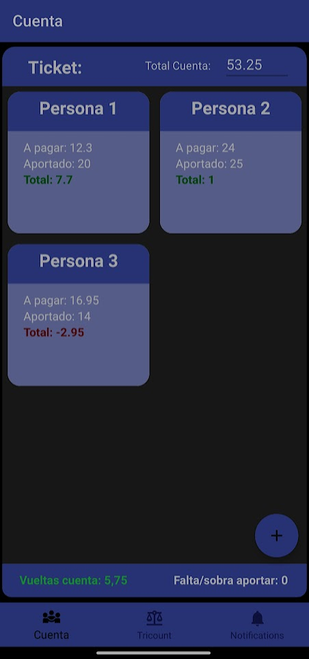
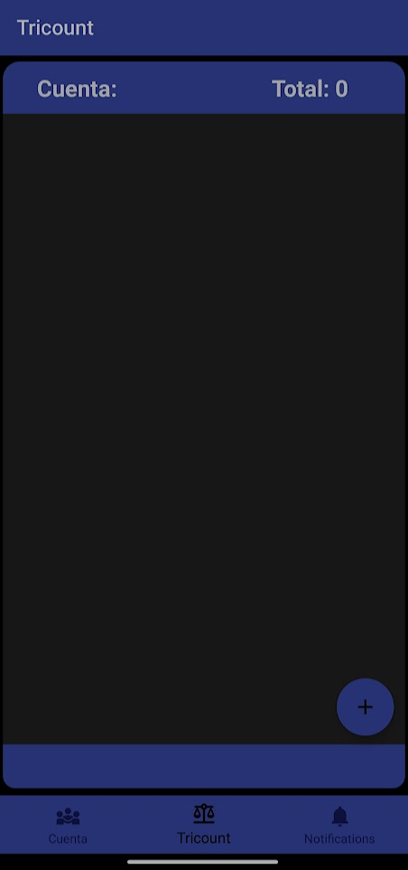
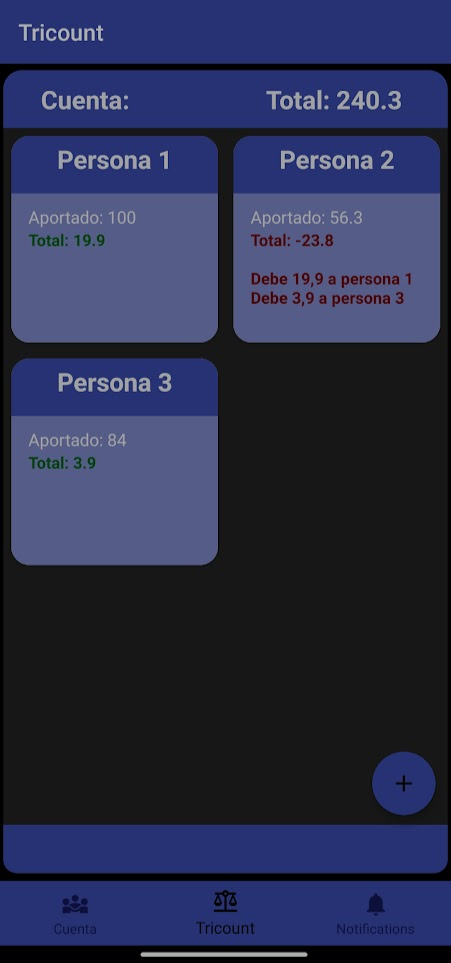

# Count

The main screen displays a number at the top, which is the target result, along with gray boxes where you must input an equation that yields that result. You have four attempts, and in each one, the correct numbers or symbols will be highlighted in green, while those placed incorrectly in a box will be highlighted in yellow. You can use the "check" button to check your answer.

In the upper left corner, you will find an information button that opens a small popup with details about your accumulated wins and losses. The red buttons with arrows allow you to reset both the score and the game itself.

space

