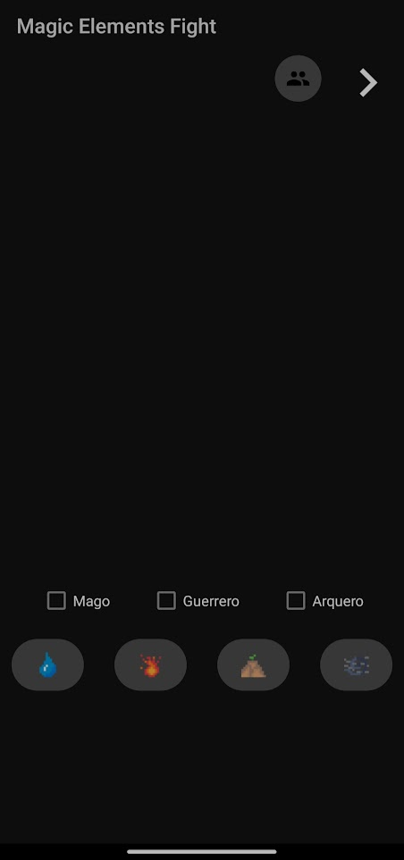
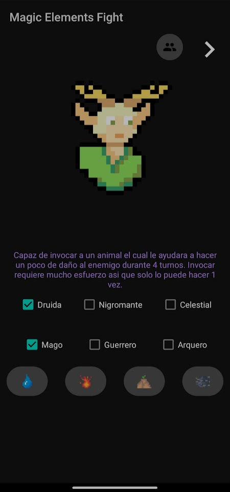
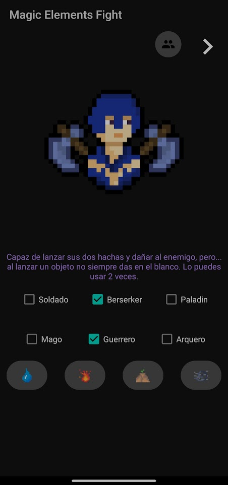
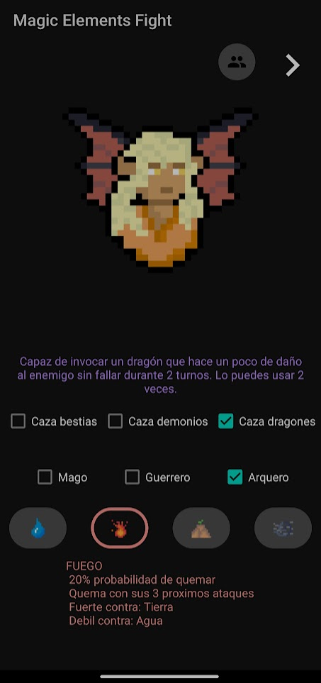
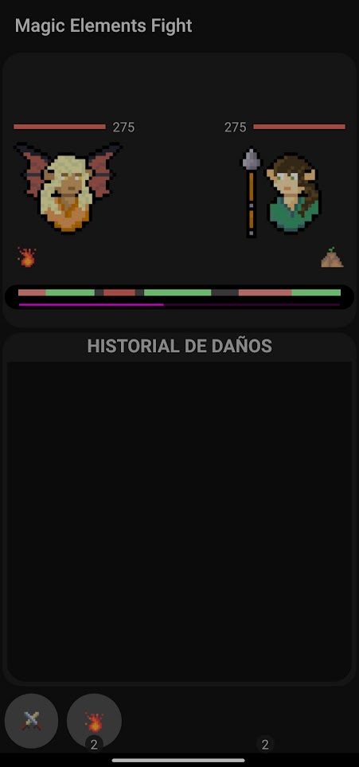
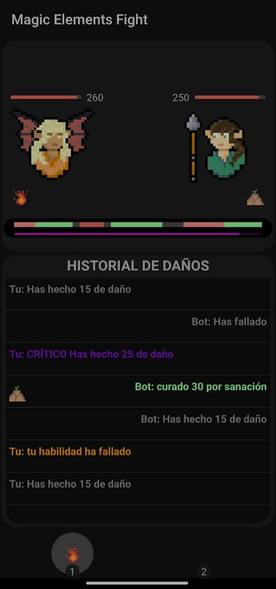

# Magic Elements Fights
* all the pictures in the game are made by myself with pixelart

On the main screen, you can select your character from three classes and nine subclasses, each with unique abilities and damage attributes. Additionally, you can choose your preferred element, which grants you a random-activated passive power. In the top right corner, there's a button to switch to two-player mode, and an arrow to access the game after selecting your character(s).

Within the game, there are two buttons at the bottom: one for attacking and another for using abilities. To successfully land an attack, you must tap it when the purple bar aligns with the red or green color; tapping it while it's gray will result in a missed attack. To successfully use an ability, three random buttons will appear on the screen briefly, and you must tap them in the specified order.

In the center of the screen, there's a log displaying the ongoing actions.

