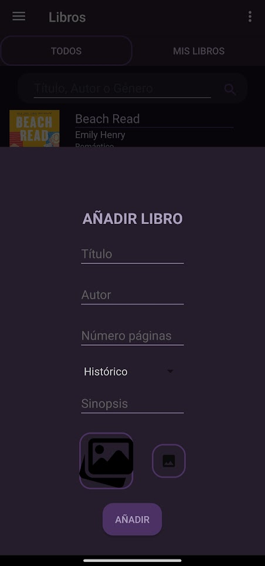
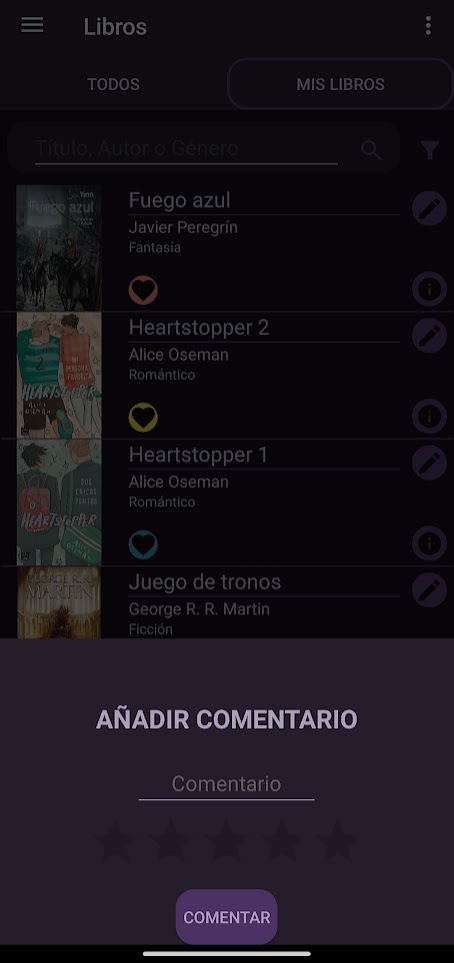

# Reading app
*Connection with a database
*users control
*visual graphics

When you first open the application, the initial screen displayed is the login screen. If you wish to register, within the login screen, there is a registration option that will take you to the corresponding screen.

Once logged in or registered, you will be redirected to the "Books" screen. On this screen, you will find a button to add books, and you will also see the "All" and "My Books" sections. Within the "My Books" section, you can select a book to add a comment about it. In the top left corner, there is a button that allows you to switch between different screens, such as "Books," "Community and Friends," and "Profile."

Within the "Community and Friends" screen, there are two sections: "Friends," where you can see your friends' comments, and "Community," where you can view comments from everyone.

In the "Profile" screen, you will find four different sections: Charts, Friends, My Comments, and Challenges. Additionally, there is a button to add a profile picture.

Below is a more detailed description of the content of each of the different screens.

In the image above, you can see the application's login screen, which consists of two text fields for the user to enter their email address and password. Additionally, there is a button to confirm the operation and another button to redirect the user to the registration screen if they do not have a previous account. This screen is essential to ensure the security of the user's account and protect their personal and reading information stored in the application.

The registration screen appears after clicking the corresponding button from the login screen. In this screen, three text fields are presented that the user must complete to create an account in the application. The first field is for entering the user's email address, followed by the password and password confirmation fields to ensure account security. The last two have a button to show what is written in them since the password is not shown on the screen by default. Once all fields are completed, the user must click the confirmation button to complete the registration process.

  

Once logged in or registered in the application, you can access the "Books" screen, where you can view all the books available on the platform. By clicking on the information button, a brief synopsis and the number of pages of each book are displayed. It is also possible to add a book to the user's library by clicking on the corresponding button and selecting the list (read, to be read, reading, unfinished), each with a different color. This way, the book will be added to the "My Books" section. If you are an administrator user, each book will have a button to delete the book from the application. At the top, there is a search bar to search for a book by its title, author, or genre. Finally, in the lower right corner of the screen, there is a button that allows any user to add a new book to the platform.

When you click on the add book button, a pop-up window opens that allows you to enter the details of the book you want to add to the application. The pop-up window contains text fields for the title, author, synopsis, and number of pages of the book. There is also a dropdown list to select the genre of the book from various options. Additionally, you can add a cover image for the book by clicking the "add photo" button, which opens the gallery for you to select the desired image. Finally, the "add" button confirms the action and adds the book to the list of books available in the application.

 

Within the "Books" screen, you can find the "My Books" option to access your personal library. In this section, there is a search bar to filter by title, author, or genre. To the right of this bar, there is a button to filter by the book's status (read, reading, or to be read). Each book in your personal library has an information button, and there is also a button to add comments about the book. This allows you to share your opinions with other users of the application.

When you click the add comment button on a book in your library, a pop-up window opens where you can write your opinion about the book. Additionally, you have the option to rate the book on a scale of 1 to 5 stars. Once you have completed your comment and rating, you can confirm the action by clicking the "comment" button. This way, you can share your thoughts with other users of the application and help the community discover new books and authors.

With the button in the upper left corner, you can access the application's menu. When you click on this button, you can choose from different sections to access: books, community and friends, and profile. Each of these sections provides different functionalities and tools for the user.

When you select the "Community and Friends" section, you will see a screen that is divided into two distinct sections. In the first section, you can view the comments and ratings your friends have made about the books they have read. In the lower section, you can see the comments and ratings from all users of the application. Additionally, at the top of the screen, there is a search bar that allows you to search for a specific user or filter comments by book, author, or specific user. This allows you to get a more comprehensive view of user opinions and ratings in the application.

When you access the profile section, a screen with four main sections is displayed. The first section presents charts of the books in the user's library, allowing you to view reading statistics. The second section contains the list of friends the user has in the application. The third section is the list of comments the user has made in the application. The last section displays a list of challenges, which can be unlocked by meeting certain reading conditions. In the upper right corner, next to the username, there is a button that allows you to change the user's profile picture. Additionally, in the lower right corner, there is a logout button, which, when pressed, ends the user's current session in the application.
